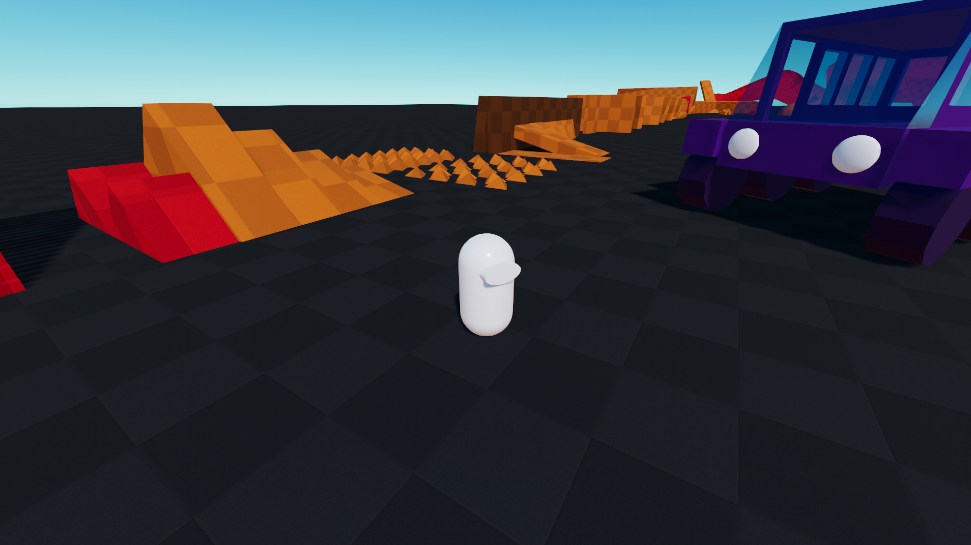

# Basic Sample

This sample provides a basic character controller and a scene containing a wide variety of obstacles and scenarios: slopes, terrain-like surfaces, dynamic bodies, moving platforms, controllable dynamic vehicle, etc... 

## Game Initialization

`SceneInitializationSystem` is responsible game initialization. It looks for the presence of a `SceneInitialization` singleton in the world (it is created by a `SceneInitialization` authoring object in the subscene). If present, it spawns the Player, Character, and Camera prefabs that are stored in the `SceneInitialization` singleton, and sets up references between these. This is how the character gets set-up in the scene when pressing Play.

## Character

The Basic character uses a structure that is very similar to the third-person standard character. The main additions are found in the `BasicCharacterApect`, where logic is implemented to allow the following features:
* Ignore grounding on physics bodies that have a certain physics tag (implemented in `IsGroundedOnHit`)
* Ignore collisions on physics bodies that have a certain physics tag (implemented in `CanCollideWithHit`)
* Ignore step handling on physics bodies that have a certain physics tag (implemented in `IsGroundedOnHit` and `OnMovementHit`)
* Modify mass ratios against certain dynamic physics bodies based on a physics tag (implemented in `OverrideDynamicHitMasses`)
* Modify velocity projection to allow bouncing against certain physics bodies based on a physics tag (implemented in `ProjectVelocityOnHits`)

AI characters use the exact same character Aspect as the main player-controlled character, but their `BasicCharacterControl` component is being controlled by the `BasicAICharacterSystem` instead of Player systems. They also have no camera.

## Input

Input handling is mostly the same as in the third-person standard character, with the main difference that it uses Unity's new input system package instead of the built-in one. Input is polled from the input system in the `BasicPlayerInputsSystem`.

## Camera

Camera handling is the same as in the third-person standard character. It is handled in `OrbitCameraSystem`.

## Vehicle

The vehicle logic is all in the `VehicleSystem`. It uses cylinder collider casts to detect wheel collisions and apply suspension forces to the vehicle physics body accordingly. For the sake of simplicity, the input-handling for the vehicle is simply hard-coded in the `VehicleSystem` class.

