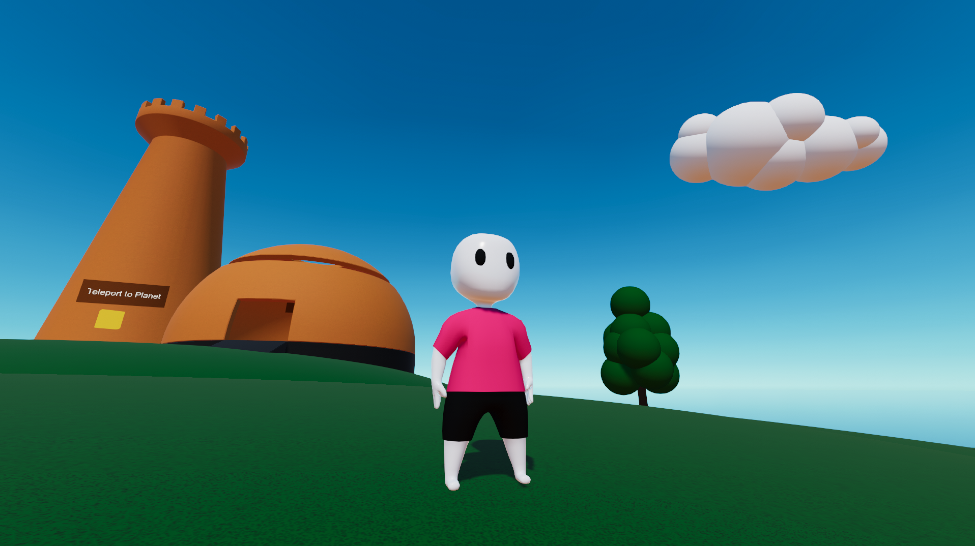

# Platformer Sample

This sample demonstrates a complex character controller with a wide variety of states, as well as animation.

## Game Initialization

`SceneInitializationSystem` is responsible game initialization. It looks for the presence of a `SceneInitialization` singleton in the world (it is created by a `SceneInitialization` authoring object in the subscene). If present, it spawns the Player, Character, and Camera prefabs that are stored in the `SceneInitialization` singleton, and sets up references between these. This is how the character gets set-up in the scene when pressing Play.

## Character

See implementation details in the [Platformer Character](./PlatformerSample/character.md) page.

## Camera

Camera handling is mostly the same as in the third-person standard character. It is handled in `OrbitCameraSystem`. The main addition in this sample is the management of smooth transitions between different camera targets & parameters that are specific to which state our character is in. This is all handled in `OrbitCameraSystem`, under the `// Camera target handling` comment.

## Inputs

Input handling is mostly the same as in the third-person standard character, with the main difference that it uses Unity's new input system package instead of the built-in one. Input is polled from the input system in the `PlatformerPlayerInputsSystem`.

## Animation

Since an Entities-based animation solution is not presently available, animation in this sample is handled with a hybrid GameObject/ECS approach. Here are the main files responsible for animation handling:
- `PlatformerCharacterAnimationAuthoring`: Defines the clip indexes of the various animation clips, as defined in the mecanim animation controller.
- `PlatformerCharacterAnimation`: Holds the clip indexes of the various animation clips, as well as the hash for the "clipIndex" parameter in the mecanim animation controller.
- `PlatformerCharacterHybridLink`: An ECS hybrid component whose purpose is to remember references to the character skinned mesh GameObject, as well as the mecanim `Animator` component. Notice that this component is of `class` type
- `PlatformerCharacterHybridData`: An ECS hybrid component whose purpose is to remember the prefab of the character skinned mesh GameObject. Notice that this component is of `class` type
- `PlatformerCharacterHybridSystem`: A system that handles instantiating/destroying the character skinned mesh GameObject along with its associated Entity. It also handles updating animation every frame by calling `PlatformerCharacterAnimationHandler.UpdateAnimation()`
- `PlatformerCharacterAnimationHandler`: A static class that handles deciding which animation state the character should have right now. It does this by observing the character state, calculating animation speeds when needed, and setting the "clipIndex" parameter in the mecanim animator accordingly

