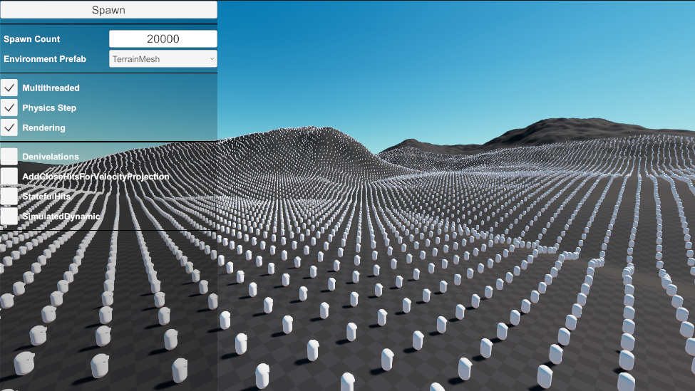

# StressTest Sample

This sample provides you with a simple scene where you can spawn X amount of characters that move in circles. There are also options for switching the level prefab, and tweaking various character settings that commonly affect performance.

## Character

The character implementation in this sample is very close to the standard characters, with the exception that it has options to turn on and off certain features. All characters are controlled by a `StressTestCharacterControlSystem` rather than being controlled by "Players" gathering input.

## StressTestManager

`StressTestManager` handles all the rest of the logic in this sample. Here are the various features & character options it manages via the sample UI at runtime:
- **Spawn button**: spawns characters.
- **Spawn Count**: amount of characters to be spawned.
- **Environment Prefab**: select which environment will be spawned.
- **Multithreaded**: toggle scheduling parallel jobs instead of a single job.
- **Physics Step**: toggle the simulation of the physics step.
- **Rendering**: toggle rendering.
- **StepHandling**: toggles step handling.
- **SlopeChanges**: toggles slope changes detection in order to deground the character in certain scenarios.
- **ProjectVelocityOnInitialOverlaps**: toggles projection of velocity on overlaps before the character moves (can help preventing tunneling for rotating character shapes).
- **StatefulHits**: toggles processing of stateful character hits in the character's update.
- **SimulatedDynamic**: toggles `KinematicCharacterProperties.SimulateDynamicBody`, which controls whether or not the character can push or be pushed by dynamic bodies.
- **Save and Restore state during update**: when active, the character will save and restore its state during its update, using the `KinematicCharacterStateSave` feature.
- **Enhanced Ground Precision**: toggles calculating a more precise ground hitz.