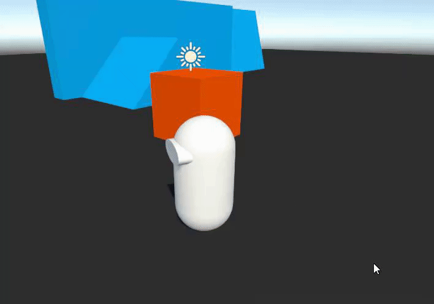

# Tutorial - Enable Dynamics

This character controller supports simulating a dynamic body for characters, which means the character can push & be pushed by other dynamic bodies with a given mass.

By default, the standard characters are already configured to support this. You can read more about the required setup for this here: [Dynamic Body Interaction](https://docs.unity3d.com/Packages/com.unity.charactercontroller@latest/index.html?subfolder=/manual/dynamic-body-interaction.html)

With our character already setup for dynamic rigidbody interactions, we need to add a dynamic box to the scene that we can push with our character. Add a cube to your Subscene, and add a collider and a rigidbody to it. Make sure the rigidbody is **not** set to "Kinematic".

Press Play, and try to push it. Play with the masses of the character and the box to see how different mass ratios affect the pushing.

Note: If you want your character to be able to stand on a dynamic rigidbody & follow its movement, simply add a `TrackedTransformAuthoring` to that rigidbody entity. We will elaborate more on this in the tutorial section on moving platforms.

## SynchronizeCollisionWorld

By default, the physics systems don't update the `CollisionWorld` after the physics step has moved bodies with their velocity. Since our character updates after physics, and relies on the `CollisionWorld` in order to detect hits, leaving things like this may result in a slight visual lag when a character pushes or gets pushed by another body. 

We can solve this by enabling the `SynchronizeCollisionWorld` option in the `PhysicsStep`'s inspector. In your Subscene, add a GameObject with the `PhysicsStep` component on it [[Screenshot]](../Images/tutorial_physicsstep.png). Then, enable `SynchronizeCollisionWorld`. This will take care of updating the `CollisionWorld` properly and get rid of any lag, but keep in mind this can add a certain performance cost.