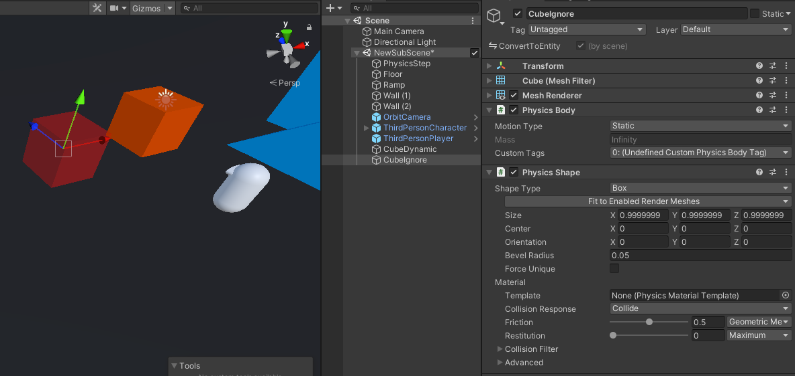
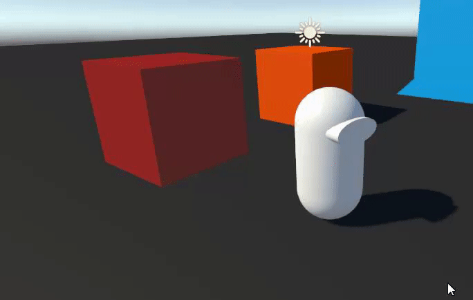

# Tutorial - Ignore Collisions Tag

We wil now make the character ignore all collisions with colliders that have a certain physics custom tag. 

In order to do this, we will first add a box with a `PhysicsShape` and a `PhysicsBody` to the Subscene, and we will assign the custom tag '0' to the "Custom Tags" of its `PhysicsBody`. This '0' tag is the tag we want to ignore collisions with:



Next, we will add a field to our `ThirdPersonCharacterComponent` so we can specify which tag we want to ignore collisions with. You will have to add `using Unity.Physics.Authoring;` at the top of the file for this to work.

```cs
// (...)
using Unity.Physics.Authoring;

[Serializable]
public struct ThirdPersonCharacterComponent : IComponentData
{
    // (...)

    public CustomPhysicsBodyTags IgnoredPhysicsTags;

    // (...)
}
```

Then, we will modify `ThirdPersonCharacterAspect.CanCollideWithHit` so that it also ignores collisions with colliders that have that physics tag. (You will have to add `using Unity.Physics.Authoring;` at the top of the file for this to work.)

```cs
public readonly partial struct ThirdPersonCharacterAspect : IAspect, IKinematicCharacterProcessor<ThirdPersonCharacterUpdateContext>
{
    // (...)
    
    public bool CanCollideWithHit(
        ref ThirdPersonCharacterUpdateContext context, 
        ref KinematicCharacterUpdateContext baseContext,
        in BasicHit hit)
    {
        ThirdPersonCharacterComponent characterComponent = CharacterComponent.ValueRO;
        
        // First, see if we'd have to ignore based on the default implementation
        if (!KinematicCharacterUtilities.IsHitCollidableOrCharacter(
                in baseContext.StoredCharacterBodyPropertiesLookup, 
                hit.Material, 
                hit.Entity))
        {
            return false;
        }

        // if not, check for the ignored tag
        if (PhysicsUtilities.HasPhysicsTag(in baseContext.PhysicsWorld, hit.RigidBodyIndex, characterComponent.IgnoredPhysicsTags))
        {
            return false;
        }

        return true;
    }
}
```

You can now set the proper ignored tag (tag 0) in your character authoring's inspector.

Finally, you can press Play, and try to collide with the box marked with the ignored tag. You should go right through. 




Note: since the callbacks of the `ThirdPersonCharacterAspect` can potentially be called multiple times per character per frame, it is always a good idea to try to make their logic as inexpensive as possible. If you can, it is still better to ignore collisions with physics categories instead of by checking for a tag or component. But there are times when procedural collision filtering like this can come in very handy.