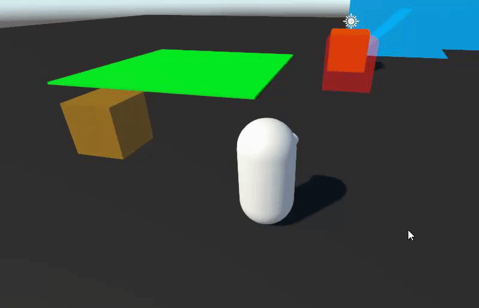

# Tutorial - Jump Pad (add forces to character)

We will now go over the implementation of a jump pad - a trigger zone that applies a sudden impulse to the character and sends it flying in a direction.

For this section, we will need to add some files to our project: [Physics Stateful Events](https://github.com/Unity-Technologies/CharacterControllerSamples/tree/master/Tutorial/Assets/Scripts/PhysicsStatefulEvents). These come from [ECS Physics Samples](https://github.com/Unity-Technologies/EntityComponentSystemSamples/tree/master/PhysicsSamples/Assets/Demos/2.%20Setup/2d.%20Events/Scripts/Stateful), and they provide an easy way to get collision/trigger events in DOTS.

Now let's create our `JumpPad` component and its authoring:
```cs
using Unity.Entities;
using Unity.Mathematics;

public struct JumpPad : IComponentData
{
    public float3 JumpForce;
}
```

```cs
using UnityEngine;
using Unity.Entities;

public class JumpPadAuthoring : MonoBehaviour
{
    public float JumpForce;

    class Baker : Baker<JumpPadAuthoring>
    {
        public override void Bake(JumpPadAuthoring authoring)
        {
            AddComponent(new JumpPad { JumpForce = authoring.JumpForce });
        }
    }
}
```

Then, add a cube to the Subscene with the following components:
* a box PhysicsShape with a "Raise Trigger Events" collision response
* a `JumpPadAuthoring` component, with its `JumpForce` set to `(0, 20, 0)` for example (an upwards force of 20)
* a `StatefulTriggerEventBufferAuthoring` (this component is from the downloaded files at the top of this page)

Now let's create our `JumpPadSystem`. See comments in code for explanations:
```cs
using Unity.Entities;
using Unity.Mathematics;
using Unity.Physics.Stateful;
using Unity.Physics.Systems;
using Unity.CharacterController;

// Update after events processing system 
[UpdateInGroup(typeof(AfterPhysicsSystemGroup))]
[UpdateBefore(typeof(KinematicCharacterPhysicsUpdateGroup))]
public partial class JumpPadSystem : SystemBase
{
    protected override void OnUpdate()
    {
        // Iterate on all jump pads with trigger event buffers
        foreach (var (jumpPad, triggerEventsBuffer, entity) in SystemAPI.Query<JumpPad, DynamicBuffer<StatefulTriggerEvent>>().WithEntityAccess())
        {
            // Go through each trigger event of the jump pad...
            for (int i = 0; i < triggerEventsBuffer.Length; i++)
            {
                StatefulTriggerEvent triggerEvent = triggerEventsBuffer[i];
                Entity otherEntity = triggerEvent.GetOtherEntity(entity);

                // If a character has entered the trigger...
                if (triggerEvent.State == StatefulEventState.Enter && SystemAPI.HasComponent<KinematicCharacterBody>(otherEntity))
                {
                    KinematicCharacterBody characterBody = SystemAPI.GetComponent<KinematicCharacterBody>(otherEntity);

                    // Cancel out character velocity in the jump force's direction
                    // (this helps make the character jump up even if it is falling down on the jump pad at high speed)
                    characterBody.RelativeVelocity = MathUtilities.ProjectOnPlane(characterBody.RelativeVelocity, math.normalizesafe(jumpPad.JumpForce));

                    // Add the jump pad force to the character
                    characterBody.RelativeVelocity += jumpPad.JumpForce;

                    // Unground the character
                    // (without this, the character would snap right back to the ground on the next frame)
                    characterBody.IsGrounded = false;

                    // Don't forget to write back to the component
                    SystemAPI.SetComponent(otherEntity, characterBody);
                }
            }
        }
    }
}
```

Now, press Play and move your character through the jump pad. Your character should get pushed into the air

