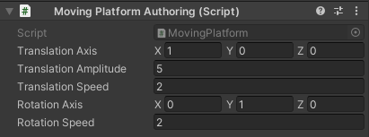
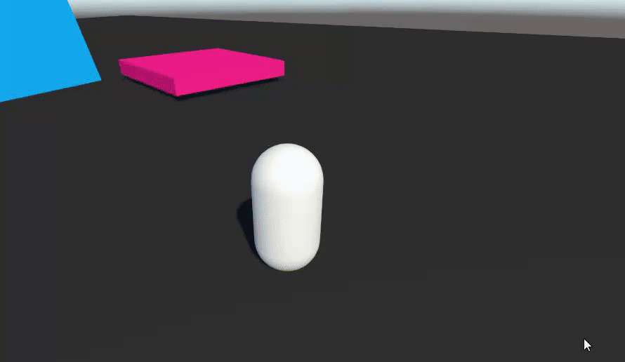

# Tutorial - Moving platforms

We will now go over how to implement moving platforms. 

The key points to remember for moving platforms are:
* The moving platform entity must have a `TrackedTransformAuthoring` component (on the object that will be baked to a rigidbody).
* The moving platform rigidbody should be interpolated if your character position is also interpolated.
* The moving platform can be moved in any way you want, but moving it with its `PhysicsVelocity` as a kinematic rigidbody will have the advantage of allowing it to push the character properly & transfer its velocity to it.

The code for a simple moving platform is provided here (component, authoring & system):

```cs
using System;
using Unity.Entities;
using Unity.Mathematics;
using UnityEngine;

[Serializable]
public struct MovingPlatform : IComponentData
{
    public float3 TranslationAxis;
    public float TranslationAmplitude;
    public float TranslationSpeed;
    public float3 RotationAxis;
    public float RotationSpeed;

    [HideInInspector]
    public bool IsInitialized;
    [HideInInspector]
    public float3 OriginalPosition;
    [HideInInspector]
    public quaternion OriginalRotation;
}
```

```cs
using Unity.Entities;
using UnityEngine;

public class MovingPlatformAuthoring : MonoBehaviour
{
    public MovingPlatform MovingPlatform;
    
    public class Baker : Baker<MovingPlatformAuthoring>
    {
        public override void Bake(MovingPlatformAuthoring authoring)
        {
            AddComponent(authoring.MovingPlatform);
        }
    }
}
```

```cs
using Unity.Entities;
using Unity.Mathematics;
using Unity.Physics;
using Unity.Physics.Systems;
using Unity.Transforms;

[UpdateInGroup(typeof(BeforePhysicsSystemGroup))]
public partial class MovingPlatformSystem : SystemBase
{
    protected override void OnUpdate()
    {
        float deltaTime = SystemAPI.Time.DeltaTime;
        float invDeltaTime = 1f / deltaTime;
        float time = (float)World.Time.ElapsedTime;

        foreach(var (movingPlatform, physicsVelocity, physicsMass, localTransform, entity) in SystemAPI.Query<RefRW<MovingPlatform>, RefRW<PhysicsVelocity>, PhysicsMass, LocalTransform>().WithEntityAccess())
        {
            if(!movingPlatform.ValueRW.IsInitialized)
            {
                // Remember initial pos/rot, because our calculations depend on them
                movingPlatform.ValueRW.OriginalPosition = localTransform.Position;
                movingPlatform.ValueRW.OriginalRotation = localTransform.Rotation;
                movingPlatform.ValueRW.IsInitialized = true;
            }

            float3 targetPos = movingPlatform.ValueRW.OriginalPosition + (math.normalizesafe(movingPlatform.ValueRW.TranslationAxis) * math.sin(time * movingPlatform.ValueRW.TranslationSpeed) * movingPlatform.ValueRW.TranslationAmplitude);
            quaternion rotationFromMovement = quaternion.Euler(math.normalizesafe(movingPlatform.ValueRW.RotationAxis) * movingPlatform.ValueRW.RotationSpeed * time);
            quaternion targetRot = math.mul(rotationFromMovement, movingPlatform.ValueRW.OriginalRotation);

            // Move with velocity
            physicsVelocity.ValueRW = PhysicsVelocity.CalculateVelocityToTarget(in physicsMass, localTransform.Position, localTransform.Rotation, new RigidTransform(targetRot, targetPos), invDeltaTime);
        }
    }
}
```

This system will make kinematic physics bodies move with a given translation & rotation speed at a fixed timestep using a math function. It calculates a `targetPos` and a `targetRot`, and then calls `PhysicsVelocity.CalculateVelocityToTarget` to calculate & apply a physics velocity that would bring the rigidbody to that target position/rotation over the next fixed update. Compared to moving the object directly with transform position/rotation, this has the added benefit of playing nicely with pushing other physics objects (and characters). The fact that it has the correct physics velocity means that it'll accurately apply impulses on other bodies it collides with.

Now, let's set up a moving platform in our scene:
* Create the `MovingPlatform`, `MovingPlatformAuthoring` and `MovingPlatformSystem` scripts in your project using the code above.
* Add a new box with a `PhysicsShape` to your subscene. Call this object "MovingPlatform"
* Make sure that this "MovingPlatform" object also has a `PhysicsBody`. Its `MotionType` must be set to "Kinematic", and its `Smoothing` must be set to "Interpolation"
* Add a `TrackedTransformAuthoring` component to the "MovingPlatform"
* Set some parameters in the `MovingPlatform` component



At this point, you can press Play and jump onto the moving platform. Your character should be able to stand on it



### Additional Notes
* If you want your character to be able to stand on a dynamic rigidbody, simply add a `TrackedTransformAuthoring` component to that rigidbody.
* If you really don't want to have to manually add a `TrackedTransformAuthoring` component to everything that a character can stand on, you could choose to write a job that iterates on all entities that have a `PhysicsVelocity` but **don't** have a `TrackedTransform`, and then add a `TrackedTransform` on those. This would take care of automatically making all kinematic or dynamic bodies in your scene able to be stood on by the character.
* Even though it is recommended to move kinematic moving platforms with their `PhysicsVelocity` for accurate physics interactions between the platform and the characters, a moving platform moved directly with `Translation` and `Rotation` can still be stood on nonetheless if it has a `TrackedTransform` component. It's just that the pushing and being pushed logic between the platform and the character will be flawed because it won't take impulses into account.

