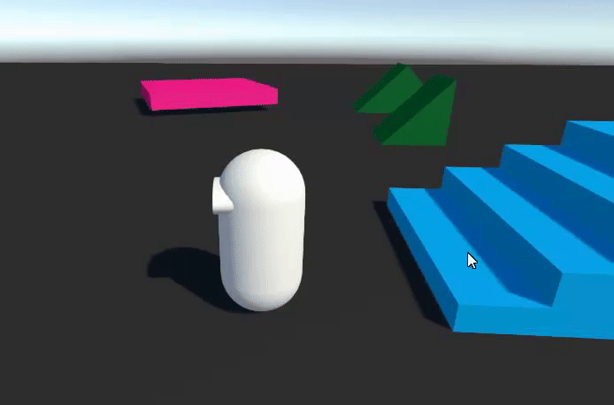
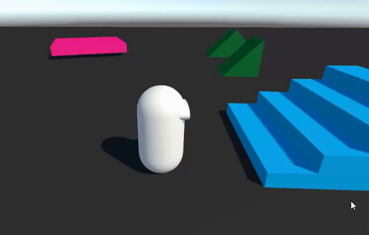
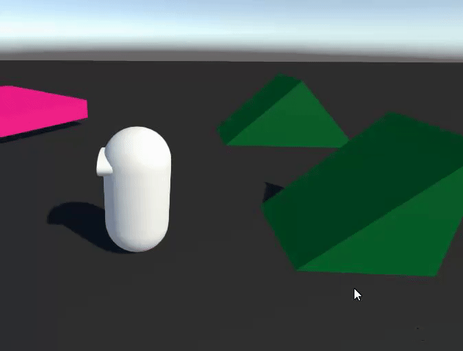
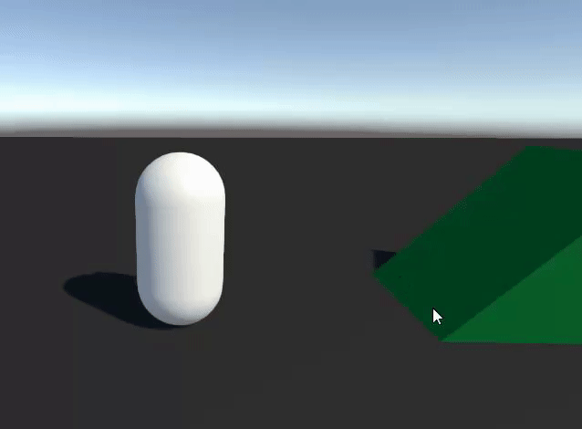
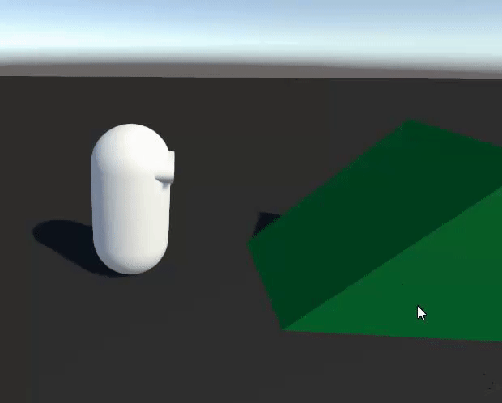

# Tutorial - Step Handling and Slope Changes

We will now take a moment to try and better understand the step-handling and slope change options that come with the standard character. The stardard characters' authoring components have a "Step And Slope Handling" subsection, under the "Character" section in the inspector. This is where you'll find all sorts of options for step-handling and slope-handling.

## Step Handling

Step handling is the concept of allowing the character to step onto elevated surfaces when it moves against them.

The "Step And Slope Handling" section contains the following fields for step-handling:
* **Step Handling**: determines if step handling is enabled
* **Max Step Height**: the max height a character can step over
* **Extra Steps Check Distance**: the horizontal distance of extra raycasts used to detect valid steps

With step handling disabled, we get this behaviour:

And with step handling enabled:

NOTE: in order to be able to "step down" without going airborne, the character must have a `KinematicCharacterBody.GroundSnappingDistance` that is high enough to match the step height.

See [Step Handling](https://docs.unity3d.com/Packages/com.unity.charactercontroller@latest/index.html?subfolder=/manual/step-handling.html) for a more in-depth explanation

## Slope Changes

The standard character component comes with the following fields:
* **Prevent Grounding When Moving Towards No Grounding**: Makes the character not consider itself grounded when moving off of a ledge
* **Has Max Downward Slope Change Angle**: Determines if we'll prevent grounding based on slope angle change
* **Max Downward Slope Change Angle**: the angle (degrees) used for preventing grounding based on slope angle change

With `PreventGroundingWhenMovingTowardsNoGrounding` off:

With `PreventGroundingWhenMovingTowardsNoGrounding` on (notice how our character trajectory seems more natural, due to not trying to stick to the ground at the top of the ramp):

With `HasMaxDownwardSlopeChangeAngle` off:

With `HasMaxDownwardSlopeChangeAngle` on and a `MaxDownwardSlopeChangeAngle` of 60:

See [Slope Management](https://docs.unity3d.com/Packages/com.unity.charactercontroller@latest/index.html?subfolder=/manual/slope-management.html) for a more in-depth explanation