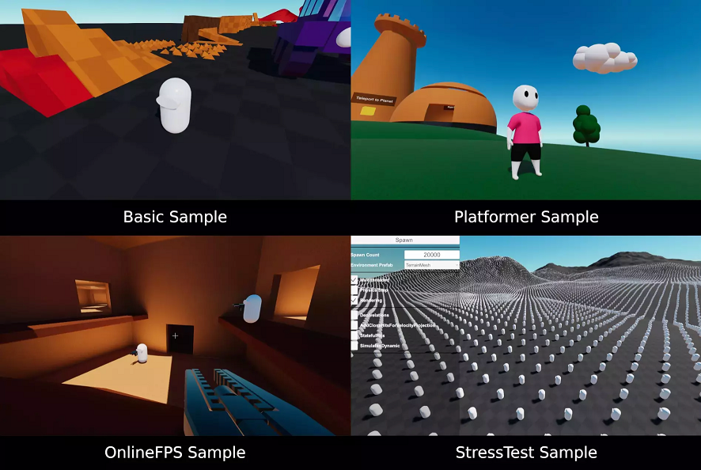

 # Samples

 Multiple sample projects using the character controller are available. These include:
 * [Basic](./Samples/basic.md): A basic character playground full of various obstacles, physics objects, etc...
 * [StressTest](./Samples/stresstest.md): A project where you can experiment with the performance of characters using all kinds of settings.
 * [Platformer](./Samples/platformer.md): A demonstration of a heavily-extended character controller with many different kinds of movement features.
 * [OnlineFPS](./Samples/onlinefps.md): A demonstration of an online first-person shooter game using client-predicted character movement.
